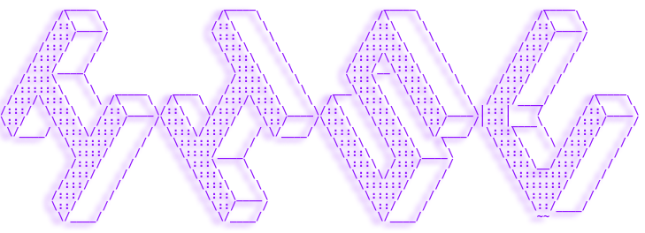

   
   
  
  
  
|                 **Language**                     |
| :------------------------------------: |
|                  |
| **Office** |
|         |
| **OS** |
|        |
  

 

<h1>✜ Workspace</h1>

 

  
# ✜ Contact

    
  
# ✜ Stats

  

<!-- TODO-IST:START -->
🏆  250 Karma Points           
🌸  Completed 0 tasks today           
✅  Completed 5 tasks so far           
⏳  Longest streak is 1 days
<!-- TODO-IST:END -->
